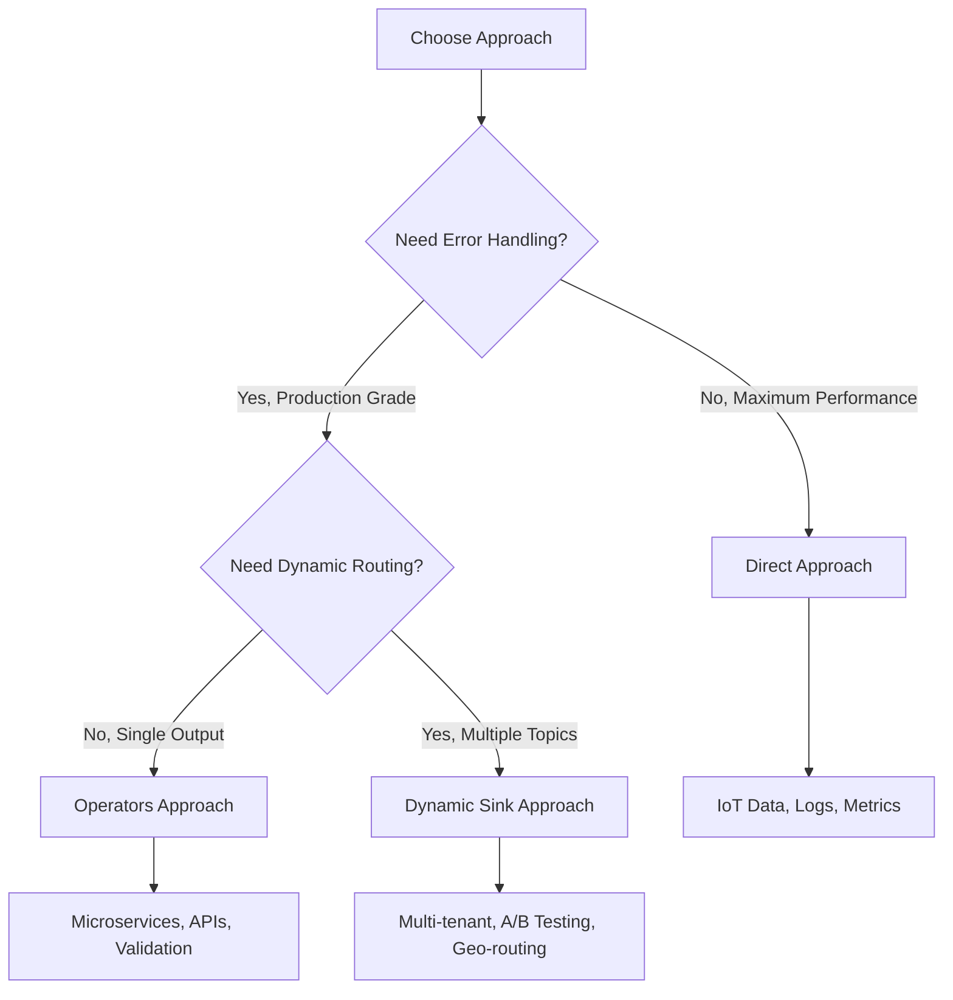

# Bytewax Pulsar Connector

A production-ready Apache Pulsar connector for Bytewax stream processing, offering three distinct approaches for different use cases: **Direct**, **Operators**, and **Dynamic Sink**.

## 🚀 Quick Start

```python
from bytewax.dataflow import Dataflow
from bytewax import operators as op
from bytewax_pulsar_connector import PulsarSource, PulsarSink, PulsarSinkMessage

# Simple high-performance pipeline
flow = Dataflow("pulsar-example")
source = PulsarSource("pulsar://localhost:6650", ["input-topic"], "my-subscription")
sink = PulsarSink("pulsar://localhost:6650", "output-topic")

input_stream = op.input("input", flow, source)
output_stream = op.map("transform", input_stream, lambda msg: 
    PulsarSinkMessage(key=msg.key, value=msg.value.upper()))
op.output("output", output_stream, sink)
```

## 📋 Table of Contents

- [Installation](#installation)
- [Three Approaches Overview](#three-approaches-overview)
- [Direct Approach](#direct-approach)
- [Operators Approach](#operators-approach)
- [Dynamic Sink Approach](#dynamic-sink-approach)
- [Official Pulsar SerDe Integration](#official-pulsar-serde-integration)
- [Configuration Reference](#configuration-reference)
- [Examples](#examples)
- [Performance Tuning](#performance-tuning)
- [Production Deployment](#production-deployment)
- [Troubleshooting](#troubleshooting)

## 🔧 Installation

```bash
# Install via poetry (recommended)
cd shared/connectors/bytewax-pulsar
poetry install

# Or install dependencies manually
pip install bytewax pulsar-client
```

## 🎯 Three Approaches Overview

| Approach | Use Case | Complexity | Error Handling |
|----------|----------|------------|----------------|
| **Direct** | High-throughput, simple transformations | ⭐ | Basic (fail-fast) |
| **Operators** | Production apps with validation | ⭐⭐⭐ | Advanced (error streams) |
| **Dynamic Sink** | Multi-tenant, routing systems | ⭐⭐⭐⭐ | Custom per route |

### When to Use Each Approach



## 🏃‍♂️ Direct Approach

**Best for**: High-throughput data processing with minimal overhead

### Advantages
- ✅ **High Performance**: Minimal overhead, direct processing
- ✅ **Simple Code**: Easy to understand and maintain
- ✅ **Resource Efficient**: Minimal CPU and memory usage
- ✅ **Fail Fast**: Immediate feedback on critical errors


### Example
```python
from bytewax_pulsar_connector import PulsarSource, PulsarSink, PulsarSinkMessage

def process_sensor_data(msg):
    """High-performance sensor data processing"""
    sensor_data = json.loads(msg.value.decode('utf-8'))
    
    # Fast transformation
    processed_data = {
        **sensor_data,
        "processed_at": int(time.time() * 1000),
        "is_anomaly": abs(sensor_data.get("value", 0)) > 1000
    }
    
    return PulsarSinkMessage(
        key=f"{sensor_data.get('device_id')}".encode('utf-8'),
        value=json.dumps(processed_data).encode('utf-8'),
        partition_key=sensor_data.get("device_id")
    )

# High-performance configuration
source = PulsarSource(
    service_url="pulsar://localhost:6650",
    topics=["iot-sensors"],
    subscription_name="sensor-processor",
    consumer_config=ConsumerConfig(
        receiver_queue_size=10000,  # Larger queue for throughput
        consumer_type=pulsar.ConsumerType.Shared
    )
)

sink = PulsarSink(
    service_url="pulsar://localhost:6650",
    topic="processed-sensors",
    producer_config={
        "batching_enabled": True,
        "batching_max_messages": 1000,
        "compression_type": "LZ4"  # Fast compression
    }
)
```

**See**: [`examples/direct_approach_example.py`](examples/direct_approach_example.py)

## 🛡️ Operators Approach

**Best for**: Production applications requiring robust error handling and data validation

### Advantages
- ✅ **Robust Error Handling**: Separate error streams for reliability
- ✅ **Official SerDe Support**: JSON, String, Pickle serialization
- ✅ **Data Validation**: Schema validation and type checking
- ✅ **Dead Letter Queues**: Error message routing for investigation
- ✅ **Monitoring Ready**: Built-in metrics and observability

### Example
```python
from bytewax_pulsar_connector import (
    PulsarSourceMessage, PulsarSinkMessage, PulsarError,
    DEFAULT_JSON_SERDE
)
from bytewax_pulsar_connector import operators as pop

def process_order(msg: PulsarSourceMessage) -> Union[ProcessedOrder, PulsarError]:
    """Process e-commerce orders with validation"""
    try:
        # Access deserialized data from message
        order_data = getattr(msg, '_deserialized_value', {})
        
        # Validate required fields
        if not order_data.get("customer_id"):
            return PulsarError(
                error="Missing customer_id",
                msg=msg
            )
        
        # Business logic and fraud detection
        risk_score = calculate_fraud_risk(order_data)
        
        return ProcessedOrder(
            order_id=order_data["order_id"],
            customer_id=order_data["customer_id"],
            amount=order_data["amount"],
            risk_score=risk_score,
            processed_at=int(time.time() * 1000)
        )
        
    except Exception as e:
        return PulsarError(
            error=f"Processing failed: {str(e)}",
            msg=msg
        )

# Production-grade flow with error handling
flow = Dataflow("order-processing")

# Input with error stream
input_stream = pop.input(
    "order-input", flow,
    service_url="pulsar://localhost:6650",
    topics=["orders"],
    subscription_name="order-processor"
)

# Deserialize JSON with error handling
json_stream = pop.deserialize_value(
    "deserialize", input_stream.oks, 
    DEFAULT_JSON_SERDE
)

# Process with validation
processed_stream = op.map("process-orders", json_stream.oks, process_order)
success_stream = op.filter("filter-success", processed_stream, 
                          lambda x: isinstance(x, ProcessedOrder))
processing_errors = op.filter("filter-errors", processed_stream, 
                             lambda x: isinstance(x, PulsarError))

# Serialize and output successful orders
serialized_success = pop.serialize_value(
    "serialize-success", success_stream, 
    DEFAULT_JSON_SERDE
)
pop.output("order-output", serialized_success,
           service_url="pulsar://localhost:6650",
           topic="processed-orders")

# Route errors to dead letter queue
all_errors = op.merge("merge-errors", input_stream.errs, json_stream.errs, processing_errors)
pop.output("error-output", all_errors,
           service_url="pulsar://localhost:6650",
           topic="order-errors")
```

**See**: [`examples/operators_approach_example.py`](examples/operators_approach_example.py)

## 🔀 Dynamic Sink Approach

**Best for**: Multi-tenant systems and content-based routing

### Advantages
- ✅ **Flexible Routing**: Route messages to different topics based on content
- ✅ **Multi-Tenancy Support**: Isolate data by tenant, region, or environment
- ✅ **Dynamic Topics**: Create topics on-demand based on routing logic
- ✅ **Custom Partitioning**: Advanced partitioning strategies per topic
- ✅ **Scalable Architecture**: Horizontal scaling with topic-based sharding

### Example
```python
from bytewax_pulsar_connector import PulsarDynamicSink, PulsarSinkMessage

def route_by_tenant(msg):
    """Route messages to tenant-specific topics based on content"""
    data = json.loads(msg.value.decode('utf-8'))
    
    # Extract routing information
    tenant_id = data.get("tenant_id", "default")
    tenant_tier = data.get("tenant_tier", "free")
    event_type = data.get("event_type", "unknown")
    region = data.get("region", "us-east-1")
    
    # Determine topic based on tenant tier and region
    if tenant_tier == "enterprise":
        topic = f"tenant-{tenant_id}-enterprise-{event_type}-{region}"
    else:
        topic = f"tenant-{tenant_id}-{event_type}-{region}"
    
    # Return message with dynamic topic set
    return PulsarSinkMessage(
        key=f"{tenant_id}:{event_type}".encode('utf-8'),
        value=msg.value,
        topic=topic,  # Dynamic topic per message
        properties={
            **msg.properties,
            "tenant_id": tenant_id,
            "tenant_tier": tenant_tier,
            "routed_to": topic
        },
        partition_key=tenant_id  # Keep tenant data together
    )

# Simple setup - no custom classes needed!
flow = Dataflow("multi-tenant-routing")

# Process messages and set their topics
messages = op.input("input", flow, source)
routed_messages = op.map("route", messages, route_by_tenant)

# Dynamic sink automatically routes to the topic in each message
dynamic_sink = PulsarDynamicSink(
    service_url="pulsar://localhost:6650",
    producer_config=ProducerConfig(
        batching_enabled=True,
        compression_type=PulsarCompressionType.LZ4
    )
)

op.output("dynamic-output", routed_messages, dynamic_sink)

# Messages automatically routed to:
# - tenant-acme-enterprise-purchase-us-east-1
# - tenant-startup-login-eu-west-1
# - tenant-corp-enterprise-error-us-west-2
```

**See**: [`examples/dynamic_sink_example.py`](examples/dynamic_sink_example.py)

## 🔄 SerDe Integration

For structured data processing, use the `deserialize_value()` and `serialize_value()` operators:

### Available SerDe Instances
```python
from bytewax_pulsar_connector import (
    # Pre-configured SerDe instances
    DEFAULT_IDENTITY_SERDE,      # Raw bytes (no conversion)
    DEFAULT_STRING_SERDE,        # UTF-8 string processing
    DEFAULT_JSON_SERDE,          # Compact JSON processing  
    DEFAULT_JSON_PRETTY_SERDE,   # Pretty-printed JSON for debugging
    DEFAULT_PICKLE_SERDE         # Python object serialization
)
```

### Usage with Operators
```python
from bytewax_pulsar_connector import operators as pop

# Input raw messages (no SerDe)
input_stream = pop.input(
    "input", flow,
    service_url="pulsar://localhost:6650", 
    topics=["events"],
    subscription_name="processor"
)

# Deserialize JSON messages with error handling
json_stream = pop.deserialize_value(
    "deserialize", input_stream.oks, 
    DEFAULT_JSON_SERDE
)

# Process successfully deserialized data
processed = op.map("process", json_stream.oks, my_processor)

# Serialize back to JSON for output
serialized = pop.serialize_value(
    "serialize", processed,
    DEFAULT_JSON_PRETTY_SERDE
)

# Output processed messages
pop.output("output", serialized,
           service_url="pulsar://localhost:6650",
           topic="processed-events")
```

## ⚙️ Configuration Reference

### Consumer Configuration
```python
consumer_config = {
    # Consumer behavior
    "consumer_type": "Shared",  # Shared, Exclusive, Failover, KeyShared
    "consumer_name": "my-consumer",
    "subscription_initial_position": "Latest",  # Latest, Earliest
    
    # Performance tuning
    "receiver_queue_size": 1000,
    "max_total_receiver_queue_size_across_partitions": 50000,
    "read_compacted": False,
    
    # Acknowledgment settings
    "ack_timeout_millis": 30000,
    "negative_ack_redelivery_delay_millis": 1000,
    
    # Dead letter queue
    "dead_letter_policy": {
        "max_redeliver_count": 3,
        "dead_letter_topic": "my-dlq"
    }
}
```

### Producer Configuration
```python
producer_config = {
    # Producer identity
    "producer_name": "my-producer",
    
    # Batching for performance
    "batching_enabled": True,
    "batching_max_messages": 1000,
    "batching_max_publish_delay_ms": 100,
    "batching_max_bytes": 1024 * 1024,  # 1MB
    
    # Compression
    "compression_type": "LZ4",  # LZ4, ZLIB, ZSTD, SNAPPY
    
    # Reliability
    "send_timeout_millis": 30000,
    "block_if_queue_full": True,
    
    # Encryption (enterprise)
    "encryption_key": "my-encryption-key",
    "crypto_key_reader": None  # Custom key reader
}
```

## 📊 Performance Tuning

### High-Throughput Configuration (Direct Approach)
```python
# Optimized for maximum throughput
high_throughput_config = {
    "consumer_config": {
        "receiver_queue_size": 50000,
        "max_total_receiver_queue_size_across_partitions": 200000,
        "consumer_type": "Shared"
    },
    "producer_config": {
        "batching_enabled": True,
        "batching_max_messages": 10000,
        "batching_max_publish_delay_ms": 50,
        "compression_type": "LZ4"
    }
}
```

### Low-Latency Configuration
```python
# Optimized for minimum latency
low_latency_config = {
    "consumer_config": {
        "receiver_queue_size": 100,
        "negative_ack_redelivery_delay_millis": 100
    },
    "producer_config": {
        "batching_enabled": True,
        "batching_max_messages": 10,
        "batching_max_publish_delay_ms": 1,
        "compression_type": "LZ4"
    }
}
```

### Resource-Constrained Configuration
```python
# Optimized for minimal resource usage
resource_constrained_config = {
    "consumer_config": {
        "receiver_queue_size": 100,
        "max_total_receiver_queue_size_across_partitions": 1000
    },
    "producer_config": {
        "batching_enabled": True,
        "batching_max_messages": 100,
        "batching_max_publish_delay_ms": 1000,
        "compression_type": "ZLIB"
    }
}
```


## 🔍 Troubleshooting

### Common Issues

#### Connection Issues
```python
# Problem: Cannot connect to Pulsar
# Solution: Check service URL and network connectivity
try:
    client = pulsar.Client("pulsar://localhost:6650")
    client.close()
    print("✅ Connection successful")
except Exception as e:
    print(f"❌ Connection failed: {e}")
    # Check: firewall, DNS, Pulsar broker status
```

#### Performance Issues
```python
# Problem: Low throughput
# Solutions:
# 1. Increase receiver queue size
consumer_config = {"receiver_queue_size": 10000}

# 2. Enable batching
producer_config = {
    "batching_enabled": True,
    "batching_max_messages": 5000
}

# 3. Use appropriate compression
producer_config = {"compression_type": "LZ4"}  # Fast compression
```

#### Memory Issues
```python
# Problem: High memory usage
# Solutions:
# 1. Reduce queue sizes
consumer_config = {"receiver_queue_size": 100}

# 2. Use smaller batches
producer_config = {"batching_max_messages": 100}

# 3. Enable compression
producer_config = {"compression_type": "ZSTD"}
```

#### Error Handling
```python
# Problem: Messages getting lost
# Solution: Use operators approach with error streams
input_stream, error_stream = pop.input(
    "input", flow,
    service_url="pulsar://localhost:6650",
    topics=["input-topic"],
    subscription_name="processor",
    raise_on_errors=False  # Don't crash on errors
)

# Route errors to dead letter queue
pop.output("errors", error_stream,
           service_url="pulsar://localhost:6650",
           topic="dead-letter-queue")
```


## 📚 Examples

All examples are available in the [`examples/`](examples/) directory:

- **[`getting_started.py`](examples/getting_started.py)**: Simple getting started example
- **[`high_performance.py`](examples/high_performance.py)**: High-throughput IoT processing
- **[`production_ready.py`](examples/production_ready.py)**: Production e-commerce processing with error handling
- **[`multi_tenant.py`](examples/multi_tenant.py)**: Multi-tenant routing system
- **[`message_tracking.py`](examples/message_tracking.py)**: Message tracking and monitoring
- **[`interactive_producer.py`](examples/interactive_producer.py)**: Interactive test data generator

### Running Examples
```bash
# Getting started (basic)
python -m bytewax.run examples.getting_started:flow

# High performance (IoT processing)
python -m bytewax.run examples.high_performance:flow

# Production ready (e-commerce with error handling)
python -m bytewax.run examples.production_ready:flow

# Multi-tenant (dynamic routing)
python -m bytewax.run examples.multi_tenant:flow

# Message tracking (monitoring)
python -m bytewax.run examples.message_tracking:flow

# Generate test data
python examples/interactive_producer.py
```

📖 **For detailed examples and usage patterns, see [examples/README.md](examples/README.md)**
